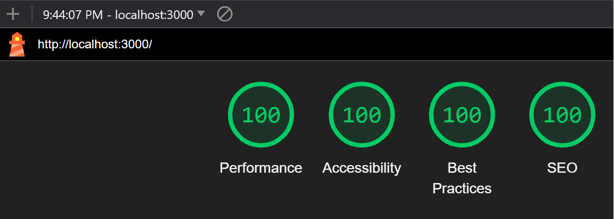

Samuel Karkache - Assignment 3
===

## About the Application
The goal of the WPI School Work Tracker is to track user's assignment and populate them in a table for future reference.
Upon logging into the application, the user is able to add a tracked assignment to the database or edit/delete an existing
assignment. Each assignment has an associated class name, assignment name, due date, difficulty, completion status (true or false),
and a priority. The priority is automatically calculated based on the assignment's difficulty, due date, and completion status. 
The user will remain logged into the app until they select the "Log Out" button in the upper left of the screen.
One of the largest challenges I faced when developed this application was ensuring that users were authorized and were unable 
to access app.html while not logged in. The authentication I chose for this application was a simple username and password 
input. This is because it was the most straightforward and least intrusive method of authentication for the application.
For the CSS framework I used Tacit since it was a lightweight framework that provided minimalist styling for the website
which was within my design goals.  

The assignment used the following middleware packages:
* express.json: The `express.json()` middleware allowed for easy JSON parsing in the server. This was useful when sending
a request to the server containing a JSON. 
* express.urlencoded: This middleware allowed for HTML forms to send JSON data with a POST request which helped implement 
the login form.
* express.static: The `express.static()` middleware helped send static files (like main.js or style.css) to the server.
* cookie-session: The cookie middleware helped store data values relating to the authentication of the user. The cookie-session
middleware allowed for a user to remain logged. 
* Custom middleware for database connection: This custom middleware checks the connection of the database and returns an 
error if any of the database connections are null.

## Note To Grader
To create an account input a username and password and click the "Sign Up" button. Alternatively you can sign in to
two existing account with data already in them.

**Account 1:**  
Username: _username_   
Password: _password_   

**Account 2:**  
Username: _sam_   
Password _karkache_   

## Technical & Design Achievements
- **Achieved 100% in all four Google Lighthouse tests**: I received 100% on all four Google Lighthouse tests for this
assignment. Below are screenshots for a lighthouse test run on both HTML pages for this project run on my laptop.

